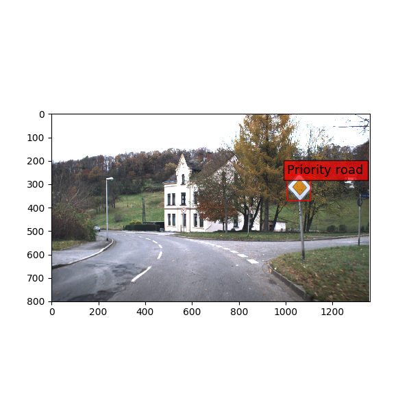

# DeepTrafficSign

### One example




### Usage

1. Setup dataset  
   ```csh
   $ wget http://benchmark.ini.rub.de/Dataset/GTSRB_Final_Training_Images.zip
   $ unzip GTSRB_Final_Training_Images.zip
   $ wget http://benchmark.ini.rub.de/Dataset/GTSRB_Final_Test_Images.zip
   $ unzip GTSRB_Final_Test_Images.zip
   $ wget http://benchmark.ini.rub.de/Dataset/GTSRB_Final_Test_GT.zip
   $ unzip GTSRB_Final_Test_GT.zip
   $ mv GT-final_test.csv GTSRB/Final_Test/Images
   ```
   
2. Data augmentation and generate train/test pickle file  
   ```csh
   $ python gen_pickle.py
   ```
   
3. Training
   ```csh
   $ python train.py
   [epoch 0] Mini-batch loss at 0: 491.711456
   [epoch 0] Minibatch accuracy: 4.7%
   ...
   [epoch 1] Mini-batch loss at 63488: 24.210030
   [epoch 1] Minibatch accuracy: 93.8%
   Test accuracy: 81.5%
   Model saved in file: models/deep_traffic_sign_model
   ```

4. Detection
   ```
   $ python detect_traffic_sign.py [target_image_file]
   ```

### License

MIT
